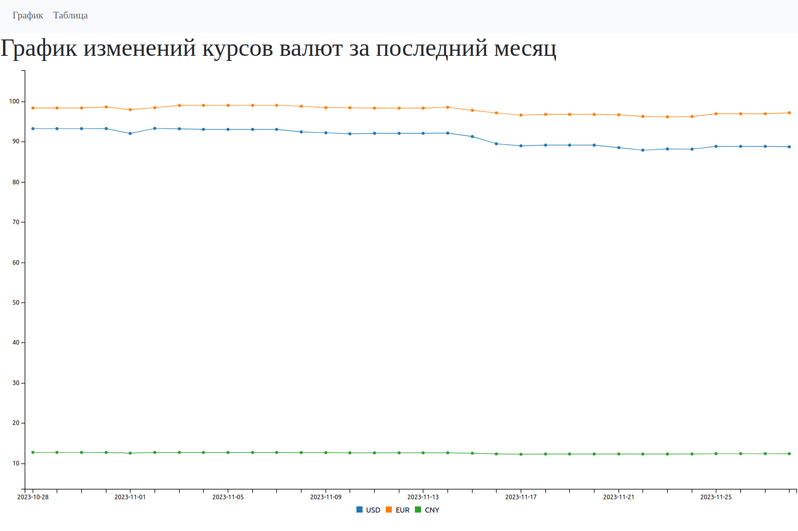
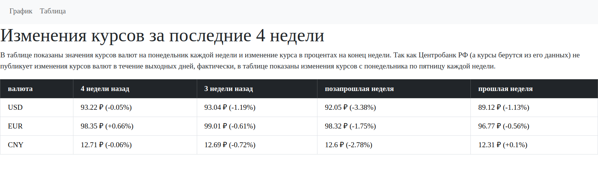

# Currency Rates Application

This is a web application that fetches and displays currency exchange rates from the Central Bank of Russia (CBR).




## Backend

### Technologies Used

- Operating System: **Linux**
- Database: **PostgreSQL**
- Ruby **3.2.2**
- Ruby on Rails: **7.1.2**
- Background Job Processing: **Sidekiq**

### Setup and Installation

1. Ensure you have a Linux-based operating system.
2. Install **PostgreSQL**.
3. Install **Ruby 3.2.2**.
4. Install **Ruby on Rails 7.1.2**.
5. **Configure** the **database.yml** file with the appropriate database settings.
6. Run `bundle install` to install project dependencies.
7. Run `yarn install` to install Bootstrap and its dependencies.
8. Run the following commands to set up the database and seed it with the latest currency exchange rates for the past month:

```bash
rails db:create
rails db:migrate
rails db:seed
```

Also, you can run

```bash
rails cbr_currency:setup
```

to run these three using one command.

And even better to run

```bash
bin/setup
```

It sets up the app properly from the 5th step, but make shure before, that you have been prepared database.yml.

### Daily Update Task

The application automatically fetches currency exchange rates (USD and EUR) from the CBR API every hour using Sidekiq. This task updates the database with the latest rates.

### Seeding

The seeds.rb file includes a task that prepares the database upon project setup and collects currency rates for the past month.

### Testing

RSpec is used for testing, covering various aspects of the application.

## Frontend

### Technologies Used

- **HTML5**
- **CSS3**
- **JavaScript ES6**
- Chart Library: **C3.js**

### Currency Rates Chart

The homepage displays a chart using the **C3.js** library to visualize the currency exchange rates for the past month.

### Data Display

The application focuses on displaying the date, currency code (USD or EUR), and the exchange rate. Other details are not stored in the database.

## Usage

- Clone the repository.
- Set up the backend and frontend dependencies as described in the "Setup and Installation" section.
- Run the Rails server:

```bash
bundle exec sidekiq -C config/sidekiq.yml &
rails s -d
```

Or you can do the same by one command:

```bash
rails cbr_currency:run
```

Visit http://localhost:3000 in your web browser to view the currency rates chart.

## Contributing

Contributions are welcome! Feel free to open issues or submit pull requests.

## License

This project is licensed under the MIT License - see the [LICENSE](https://mit-license.org/license.txt) file for details.

